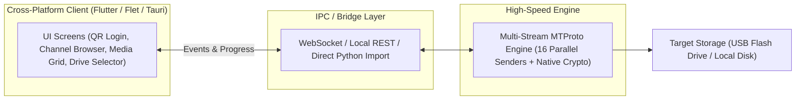

# 🚀 Cross-Platform Client Application Guide: Telegram High-Speed Downloader

This guide details how to build an intuitive, cross-platform client application (macOS, Windows, Linux, and optionally Android/iOS) for the Telegram High-Speed Downloader, evaluating **Flutter**, **Flet (Flutter in Python)**, and **Tauri v2**.

---

## 🏗️ Core Architecture: Decoupled Engine & UI

For high-speed downloading with parallel MTProto connections and native hardware cryptographic decryption, the recommended pattern is the **Decoupled Architecture**:



---

## 📱 Option 1: Flutter (Dart)

[Flutter](https://flutter.dev) is Google’s open-source multi-platform framework. A single Dart codebase compiles natively to **macOS, Windows, Linux, Android, iOS, and Web**.

### Approach A: Flutter UI + Bundled Python Engine (Recommended for Flutter)
* **How it works**: Keep the tested Python MTProto engine (`parallel_downloader.py`) as a compiled background process (sidecar). When Flutter opens, it launches this local daemon and interacts over a local WebSocket (`ws://localhost:8080/ws`) or JSON-RPC.
* **Advantages**:
  * No need to rewrite Telegram's complex MTProto multi-stream striping or cross-DC auth key caching in Dart.
  * Full access to Flutter's visual ecosystem (fluid animations, native desktop menus, system tray, dark/light themes).
  * Fast delivery time.
* **Code Flow (Dart Process Spawn)**:
  ```dart
  import 'dart:io';

  class EngineService {
    Process? _process;

    Future<void> startEngine() async {
      _process = await Process.start('./engine_bin/engine', ['--port', '8080']);
      // Connect to ws://localhost:8080 for live download events
    }

    void stopEngine() {
      _process?.kill();
    }
  }
  ```

### Approach B: Pure Flutter with TDLib via Dart FFI
* **How it works**: Use Telegram's official C++ library (**TDLib**), compiled for each operating system, and connect it using Dart Foreign Function Interface (FFI) packages like [`tdlib`](https://pub.dev/packages/tdlib).
* **Advantages**: Zero Python runtime; everything is compiled into a single monolithic Flutter executable.
* **Trade-off**: TDLib controls its own download connection pooling internally and does not easily support custom 16-worker striped MTProto chunks or direct raw disk writing like Telethon.

---

## ⚡ Option 2: Flet — "Flutter Directly in Python" (The Sweet Spot)

[Flet](https://flet.dev) allows you to build **Flutter desktop, mobile, and web applications entirely in Python**.

### Why Flet is the Fastest Path:
1. **Direct Import**: Your UI code can directly call:
   ```python
   from parallel_downloader import download_media_fast
   from telethon import TelegramClient
   ```
   No WebSockets, no IPC, no process management, and no rewriting of code.
2. **Real Flutter Engine**: Flet is not a web view. It renders UI elements using the actual **hardware-accelerated Flutter C++ engine** at 60 FPS.
3. **One Language**: Zero context switching between Dart and Python.
4. **Native Packaging**: Builds into standalone `.app` (macOS), `.exe` (Windows), and `.apk` (Android) with `flet pack`.

### Example Flet Architecture:
```python
import flet as ft
from parallel_downloader import download_media_fast

def main(page: ft.Page):
    page.title = "Telegram High-Speed Downloader"
    page.theme_mode = ft.ThemeMode.DARK
    page.window_width = 1000
    page.window_height = 700

    # UI Components
    qr_image = ft.Image(src="https://via.placeholder.com/200", width=200, height=200)
    speed_text = ft.Text("0.0 MB/s", size=20, weight=ft.FontWeight.BOLD)
    progress_bar = ft.ProgressBar(value=0, width=400)

    page.add(
        ft.Row([
            ft.NavigationRail(
                destinations=[
                    ft.NavigationRailDestination(icon=ft.icons.QR_CODE, label="Login"),
                    ft.NavigationRailDestination(icon=ft.icons.FOLDER, label="Channels"),
                    ft.NavigationRailDestination(icon=ft.icons.DOWNLOAD, label="Downloads"),
                ],
                selected_index=0,
            ),
            ft.VerticalDivider(width=1),
            ft.Column([
                ft.Text("Scan with Telegram Mobile App", size=24, weight=ft.FontWeight.BOLD),
                qr_image,
                speed_text,
                progress_bar,
            ], expand=True, alignment=ft.MainAxisAlignment.CENTER),
        ], expand=True)
    )

ft.app(target=main)
```

---

## 🦀 Option 3: Tauri v2 (Rust + Modern Web)

[Tauri v2](https://v2.tauri.app) is the modern gold standard for building ultra-lightweight desktop and mobile applications.

* **Frontend**: Any web framework (HTML5, Tailwind CSS, Vue, React, or Svelte).
* **Backend**: Rust (running native OS threads, system tray, window lifecycle).
* **Python Integration**: Tauri has native support for **Sidecars** (bundling a compiled Python CLI executable inside the app bundle).
* **Key Strengths**:
  * **Ultra-small binary**: ~10 MB (compared to Electron's 150 MB+).
  * **Low memory consumption**: Uses native OS webviews (WebKit on macOS/iOS, WebView2 on Windows), taking only ~30 MB of RAM.

---

## 📊 Comprehensive Technology Comparison

| Evaluation Metric | Flutter (Dart) | Flet (Flutter in Python) | Tauri v2 (Rust + Web) | Electron (Node + Web) |
| :--- | :--- | :--- | :--- | :--- |
| **Target Platforms** | macOS, Win, Linux, iOS, Android, Web | macOS, Win, Linux, Android | macOS, Win, Linux, iOS, Android | macOS, Win, Linux |
| **Executable Size** | ~35 MB | ~45 MB | **~8 – 15 MB** | ~150 MB+ |
| **Memory Footprint** | Low (~50 MB) | Medium (~60 MB) | **Ultra-Low (~30 MB)** | High (200 MB+) |
| **Code Reuse from Existing Project** | Requires bridge (WebSocket/CLI) | **100% Direct (`import`)** | Bundled as Sidecar | Requires bridge (IPC) |
| **UI Polish & Animations** | ⭐⭐⭐⭐⭐ (Industry Leader) | ⭐⭐⭐⭐⭐ (Flutter engine) | ⭐⭐⭐⭐⭐ (Web Standards) | ⭐⭐⭐⭐⭐ |
| **Time to Market** | 2–3 weeks | **2–4 days** | 1–2 weeks | 1–2 weeks |

---

## 🎨 Recommended Client UI/UX Specification

Regardless of framework choice, the client app should feature these 5 screens:

### 1. Visual Authentication (Zero-Friction Login)
- **Central QR Code**: Large, auto-refreshing QR code with a circular expiration countdown ring.
- **Visual Instructions**: Steps showing *Telegram app ➔ Settings ➔ Devices ➔ Link Desktop Device*.
- **Account Switcher Hint**: Reminds users with multiple accounts to select the desired profile on mobile before scanning.
- **Fallback Tab**: Phone number login with interactive SMS code and 2FA password box (with visibility eye toggle).

### 2. Channel & Chat Explorer
- **Sidebar**:
  - Displays avatar, name, and total file count for all channels, groups, and Saved Messages.
  - Quick search bar with instant fuzzy filtering.
  - Direct URL input box (accepts `https://t.me/c/...`, `@username`, or invite links).

### 3. Smart Media Table & Deduplication
- **Media Cards**:
  - Video thumbnail preview, duration, file resolution, formatted size (e.g. `1.42 GB`).
  - **Status Badges**:
    - `[✓ Downloaded]` (Green): Already exists on the selected disk with matching exact byte size.
    - `[⏳ Pending]` (Blue/Yellow): New file ready for download.
    - `[⚠️ Incomplete]` (Orange): 0-byte or corrupted file (automatically replaced on download).
- **Batch Actions**: One-click **"Download All New"** button that automatically filters out completed files.

### 4. USB Flash Drive Selector
- **Drive Cards**:
  - Automatically lists external disks (e.g., `Hosainy USB (/Volumes/Hosainy USB) — 55.7 GB free`).
  - Storage bar showing free space before and after the queued download batch.
  - "Browse Custom Folder..." button launching native OS directory dialog.

### 5. Live Speedometer & Flood Shield
- **Speedometer**: Gauge showing combined transfer rate (e.g. `42.5 MB/s`) and batch ETA.
- **Worker Throttle Slider**: Easy slider to adjust between `4 workers` (Safe/Conservative), `8 workers` (Balanced), and `16 workers` (Maximum Turbo).
- **Telegram Flood Shield**:
  - Reuses cached cross-DC authorization keys to prevent `ExportAuthorizationRequest` flood wait.
  - If Telegram enforces a server cooldown, displays a clear countdown timer overlay with options to wait or safely pause.

---

## 🛠️ Step-by-Step Implementation Roadmap

1. **Option Decision**:
   - For fastest delivery using current Python code: Build with **Flet** (real Flutter UI in Python).
   - For dedicated multi-platform mobile & desktop: Build frontend with **Flutter (Dart)** and run Python as a background sidecar service.
2. **Local API / Service Layer**:
   - Expose download progress, speeds, chat lists, and QR codes via event callbacks or WebSockets.
3. **Packaging & Distribution**:
   - **macOS**: Bundle as `.app` and package into a drag-and-drop `.dmg` installer.
   - **Windows**: Package with PyInstaller or InnoSetup into a signed single-file `.exe`.
