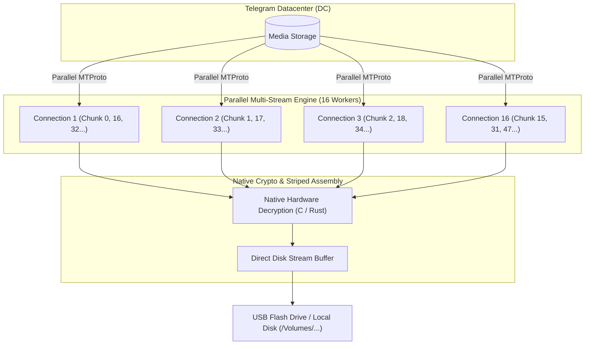

# ⚡ Telegram High-Speed Terminal Downloader

[](https://www.python.org/downloads/)
[](https://opensource.org/licenses/MIT)
[](https://github.com/LonamiWebs/Telethon)
[](https://github.com/cher-nov/cryptg)

A high-performance terminal downloader for Telegram that bypasses the single-connection throttling of official desktop and mobile apps. Downloads files and videos directly from **Channels**, **Groups**, and **Saved Messages** to your **Flash Card / USB Drive** or local storage using parallel MTProto streams and hardware-accelerated decryption.

---

## 🚀 Why is This Faster Than the Official Telegram App?

| Feature | Official Telegram App | Telegram High-Speed Downloader |
| :--- | :--- | :--- |
| **MTProto Connections** | Single stream (1 connection) | **Up to 16 parallel connections** |
| **Download Speeds** | Throttled (~1.5 – 3.5 MB/s) | **Saturates full connection bandwidth** |
| **Decryption** | Pure CPU overhead | **Native C/Rust acceleration (`cryptg` + `tgcrypto`)** |
| **Chunk Streaming** | Sequential request-response | **Concurrent striped 512 KB chunks** |
| **Target Storage** | Downloads to internal disk, then copies | **Streams directly to Flash Drive / USB** |
| **Deduplication** | Re-downloads duplicates | **Smart name & exact byte-size verification** |



---

## ✨ Features

- **⚡ 16x Multi-Stream Engine**: Connects concurrently to Telegram datacenters, distributing striped chunks across up to 16 parallel workers.
- **🛡️ Smart Name & Size Deduplication**: Inspects your destination folder and automatically detects existing complete files by matching **filename** and **exact size in bytes**. Existing files are skipped automatically.
- **🧹 Broken Download Recovery**: Automatically identifies 0-byte or corrupted partial files left from interrupted downloads, cleans them up, and re-downloads fresh data.
- **📱 Dual Authentication & QR Code Login**:
  - **QR Code Scan**: Displayed right in your terminal. Open Telegram on your phone ➔ *Settings ➔ Devices ➔ Link Desktop Device* and scan.
  - **Bypasses Rate Limits**: QR code login circumvents Telegram's `PhonePasswordFloodError` (caused by failed 2FA password attempts).
  - **Phone Number Login**: Standard SMS / Telegram verification code login.
- **📢 Any Source**: Download from **Channels**, **Supergroups**, **Groups**, or **Saved Messages** (`me`).
- **💾 Auto-Detects USB Flash Drives**: Automatically scans mounted flash drives under macOS (`/Volumes/...`) and Linux, displaying free disk space before downloading.
- **📊 Interactive Rich TUI**: Clean tables displaying file names, types, sizes, upload dates, and real-time status (`✓ Downloaded`, `⏳ Pending`, `⚠️ Incomplete`).
- **🏎️ Live Progress Monitoring**: Per-file progress bars with real-time transfer rate (MB/s), downloaded bytes, and ETA.
- **🔒 Privacy First**: Your credentials, auth tokens, and session keys are stored locally on your own machine. Zero telemetry, zero external dependencies.

---

## 🛠️ Step 1: Get Your Free Telegram API Credentials (2 Minutes)

Telegram requires an `api_id` and `api_hash` to authorize MTProto client connections:

1. Open **[https://my.telegram.org](https://my.telegram.org)** in your web browser.
2. Enter your phone number (with country code) and the confirmation code sent to your Telegram app.
3. Click on **API development tools**.
4. Fill in any App title and Short name (e.g., `downloader` and `downloader`).
5. Click **Create application**.
6. Copy your **`App api_id`** (numeric) and **`App api_hash`** (alphanumeric string).

---

## 📥 Installation

### 1. Clone the repository
```bash
git clone https://github.com/sohrabezzati/telegram-downloader.git
cd telegram-downloader
```

### 2. Run the quick launcher
The included `run.sh` script automatically creates a Python virtual environment and installs all dependencies on first run:

```bash
chmod +x run.sh
./run.sh
```

*(Manual setup alternative: `python3 -m venv .venv && source .venv/bin/activate && pip install -r requirements.txt`)*

---

## 🎮 Usage Guide

### First Launch
1. On your first run, you will be prompted for your **API ID** and **API HASH** (saved locally to `.env`).
2. Choose your preferred login method:
   - **`[1] QR Code Login` (Recommended)**: Scan the ASCII QR code with your mobile Telegram app (*Settings ➔ Devices ➔ Link Desktop Device*).
   - **`[2] Phone Number`**: Receive an authorization code via Telegram or SMS.
3. If Two-Step Verification (2FA) is enabled, enter your password.
4. Your authenticated session is saved to `tg_session.session` for automatic future logins.

---

### Step-by-Step Flow

#### 1. Select Download Destination
The tool detects attached flash drives and presents an interactive menu:
```text
Select Download Destination:
 [1] Hosainy USB (/Volumes/Hosainy USB) — 55.72 GB free
 [2] Untitled (/Volumes/Untitled) — 38.97 GB free
 [3] Local folder: ./downloads
 [4] Enter custom folder path...
Choose destination [1/2/3/4] (1): 1
✓ Destination: /Volumes/Hosainy USB
Available free space on destination: 55.72 GB
```

#### 2. Select Source (Channel, Group, or Saved Messages)
```text
Select Download Source:
 [1] 📌 Saved Messages (My Cloud Storage)
 [2] 📢 Choose from my Channels & Groups
 [3] 🔗 Enter Channel Username, Link, or ID
Choose source [1/2/3] (1): 2
```
Choosing **`[2]`** dynamically lists your joined channels and groups. Simply enter the number of the desired channel.

#### 3. Review Files & Smart Status
Files found in the channel are displayed alongside their on-disk status:
```text
Files Found in My Channel:
┌────┬─────────────────────────────┬──────────┬───────────┬──────────────┬──────────────────┐
│  # │ File Name                   │ Type     │      Size │ Status       │ Date             │
├────┼─────────────────────────────┼──────────┼───────────┼──────────────┼──────────────────┤
│  1 │ documentary_part1.mp4       │ Video    │   1.42 GB │ ✓ Downloaded │ 2026-10-06 14:22 │
│  2 │ documentary_part2.mp4       │ Video    │ 650.12 MB │ ⏳ Pending    │ 2026-10-05 09:15 │
│  3 │ notes_archive.zip           │ Document │  12.45 MB │ ⏳ Pending    │ 2026-10-04 18:30 │
└────┴─────────────────────────────┴──────────┴───────────┴──────────────┴──────────────────┘

Found 3 total files (1 already downloaded, 2 pending)

Enter files to download ('new' for 2 pending, 'all', '1,3,5', '1-5') [new]:
```

- Simply press **Enter** to accept the default `new` choice, downloading only pending files!
- Or type `all`, `1`, `1,3,5`, or ranges like `1-10`.

---

## ⚙️ Command-Line Options (Headless / Scripting)

All prompts can be bypassed using command-line arguments:

```bash
# Download from a specific channel directly to your USB drive
./run.sh -c @my_channel -o "/Volumes/Hosainy USB"

# Download all new files from a private channel by title
./run.sh -c "Private Backup" --all

# Inspect the last 150 messages in the channel
./run.sh -c @my_channel --limit 150

# Increase or decrease parallel MTProto workers (default: 16)
./run.sh -c @my_channel -w 8

# Force re-download / overwrite existing files
./run.sh -c @my_channel --overwrite

# Log out of current Telegram session and switch accounts
./run.sh --logout
```

### CLI Options Reference

| Flag | Argument | Description | Default |
| :--- | :--- | :--- | :--- |
| `-c`, `--channel`, `--chat` | `TEXT` | Channel username (`@channel`), title, link, or ID | Interactive prompt |
| `-o`, `--output` | `PATH` | Target download folder (e.g. `/Volumes/MyUSB`) | Interactive prompt |
| `-l`, `--limit` | `INT` | Number of recent messages to scan | `50` |
| `-w`, `--workers` | `INT` | Number of concurrent MTProto download workers | `16` |
| `--all` | Flag | Download all detected files automatically | `False` |
| `--overwrite` | Flag | Re-download and overwrite files already on disk | `False` |
| `--logout` | Flag | Clears session and saved phone number to switch accounts | `False` |

---

## 🔧 Troubleshooting & FAQ

### What is `PhonePasswordFloodError`?
If you enter an incorrect Two-Step Verification (2FA) password multiple times in a row, Telegram's servers enforce a temporary lockout on your phone number (`PhonePasswordFloodError`), refusing to send SMS or Telegram login codes.
- **Fix**: Run `./run.sh` and select **`[1] QR Code Login`**. QR login bypasses code requests completely and allows you to log in immediately with your correct 2FA password.
- **Important**: Do not repeatedly spam phone login attempts, as Telegram will reset the lockout timer (which normally lasts 1–24 hours).

### How do I switch accounts?
1. Run `./run.sh --logout`. This removes the saved session file and clears the phone number from `.env`.
2. Run `./run.sh`.
3. If using **QR Code Login**, make sure you switch to your desired account **inside the Telegram mobile app** before scanning the QR code, as Telegram links whichever account is active on your phone.

### Can I download files larger than 2 GB?
Yes! Telegram MTProto allows up to 2 GB for regular users and up to 4 GB for Telegram Premium users. Parallel chunk streaming handles large files seamlessly.

---

## 🔐 Security & Privacy

- All API keys, tokens, and sessions remain strictly on your local machine (`.env` and `tg_session.session`).
- The repository's `.gitignore` explicitly excludes all credentials, sessions, and downloaded media files from being committed.
- No third-party servers, tracking, or proxy intermediaries are involved; all network traffic goes directly to official Telegram datacenters.

---

## ⭐ Show Your Support

If this tool saved you time or boosted your download speeds, please give it a **⭐ Star** on [GitHub](https://github.com/sohrabezzati/telegram-downloader)! It helps others discover the project and motivates future enhancements.

---

## 📄 License

This project is licensed under the [MIT License](LICENSE).

