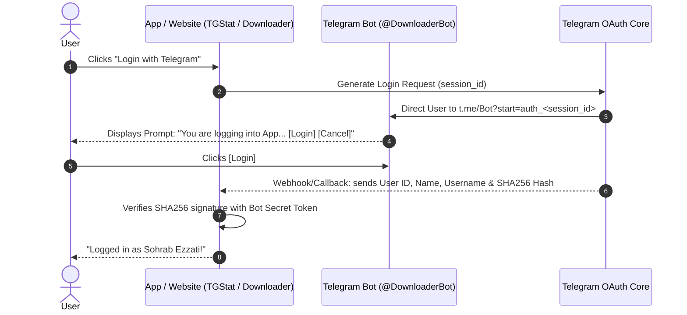
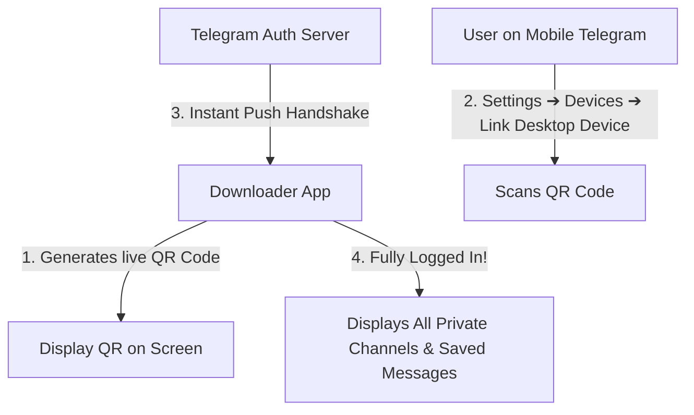

# 🔐 Telegram Login Architecture Analysis: TGStat Bot Login vs. Full Account Access

This document analyzes the **"Login with Telegram"** mechanism used by platforms like [TGStat.com](https://tgstat.com) (via `@TGStat_Bot`), assesses whether it can provide access to all downloadable content (channels, private chats, and Saved Messages), and presents the easiest login architectures for end users.

---

## 1. 🎯 Direct Answer: Does the TGStat Bot Login Work for Our App?

### ⚠️ The Short Answer:
**No for direct private channel/chat browsing, but YES for seamless user identification, link downloads, and the bot forwarding queue.**

### Why? (Telegram Security Boundary)

| Login Method | What Telegram Grants | Can it Browse Private Channels & Saved Messages? | Can it Download Media at 16x Speed? |
| :--- | :--- | :---: | :---: |
| **TGStat-style Bot Login** *(Telegram Login Widget)* | **Identity only**: User ID, Name, Username, Profile Photo, Auth Date, Hash signature. | ❌ **No**. Telegram strictly forbids bots from accessing a user's private inbox or channels. | ✅ **Yes**, for files forwarded to the bot or public channel links. |
| **MTProto Device Link** *(QR Code / `auth.exportLoginToken`)* | **Full MTProto Session**: Acts as an authorized device (like Telegram Desktop / Web). | ✅ **Yes**. Full access to all private channels, groups, and Saved Messages. | ✅ **Yes**, direct 1-click downloads from any channel. |

---

## 2. 🔬 How the TGStat Bot Login Works Under the Hood

The flow shown in your screenshot operates using the **Telegram Login Widget / Bot OAuth protocol**:



### What You Get:
1. **Zero-Friction Authentication**: The user never types an email, phone number, SMS code, or 2FA password.
2. **Cryptographic Verification**: You know with 100% certainty that the user is who they claim to be.
3. **Paired Communication Channel**: Your app and bot know each other's Telegram ID.

### What Telegram Intentionally Blocks:
Telegram prevents this login from returning an `auth_key` (MTProto session). If Telegram allowed any bot to read personal messages just because a user clicked "Login", any malicious website could steal private messages.

---

## 3. 💡 How We CAN Leverage the TGStat Flow in Our App

Even though it cannot read private channels directly without an MTProto session, the TGStat bot login is **the cleanest UX for non-technical users**:

### The "Zero-Credentials" Bot Workflow:
1. **User taps "Login with Telegram"**:
   - The bot opens in Telegram.
   - User taps **`[ Login ]`** (exactly like your screenshot).
   - The app instantly unlocks without asking for phone numbers or passwords.
2. **How User Downloads Files**:
   * **Option A — Forward Any File**: The user forwards any video, file, or post from **any private or public channel** into the bot. The bot instantly sends it to the user's app queue.
   * **Option B — Paste Any Public Link**: The user pastes any link (`t.me/channel/123`) in the app or bot.
3. **1-Click Download**:
   - The app displays the media cards (with thumbnail, title, size).
   - User clicks **"Download (16x Speed)"** ➔ saved directly to phone/disk!

---

## 4. 🚀 How to Make "Full Account Access" (All Private Channels) Super Easy

If the user wants the app to **automatically list all their private channels and Saved Messages**, they need an **MTProto session**. 

Here is how to make MTProto login **10x easier** than typing phone numbers and passwords:

---

### Option A: The Modern QR Code Scan (`auth.exportLoginToken`) — *Recommended*

This is the exact method used by **Telegram Desktop**, **Telegram Web (web.telegram.org)**, and **Telegram iPad**.



#### Why Users Love This:
1. **No typing phone numbers**.
2. **No SMS code waiting** or SMS deliverability issues.
3. **Completely avoids 2FA flood locks** (`PhonePasswordFloodError`).
4. **Instant access**: 1 scan (< 2 seconds) and all private channels, groups, and Saved Messages are immediately visible in the app!

---

### Option B: Mobile Deep-Link Login (`tg://login?token=...`)

When the user is running the Downloader App on the **same mobile phone** where Telegram is installed:
1. The app requests a login token from Telegram MTProto.
2. Instead of scanning a QR with a camera, the app opens the URL scheme:
   `tg://login?token=<base64_token>`
3. Telegram mobile automatically opens a native dialog:
   **"Allow login to Telegram Downloader?" [Confirm] [Decline]**
4. User taps **Confirm**.
5. The session is established on the mobile phone immediately!

---

## 5. 🏆 The Recommended Hybrid Solution: "Dual Login"

To provide the ultimate user experience for all user skill levels, provide two simple buttons on the welcome screen:

```
┌─────────────────────────────────────────────────────────────┐
│                 ⚡ Telegram Downloader                      │
│                                                             │
│  Choose how you want to connect:                            │
│                                                             │
│  ┌───────────────────────────────────────────────────────┐  │
│  │ 🤖 1-Click Bot Connect (No Phone/Password Required)   │  │
│  │    • Instant login via @DownloaderBot                 │  │
│  │    • Download any forwarded file or public link       │  │
│  │    • 100% safe & passwordless                         │  │
│  └───────────────────────────────────────────────────────┘  │
│                                                             │
│  ┌───────────────────────────────────────────────────────┐  │
│  │ 📱 Full Account Sync (QR Code / Device Link)          │  │
│  │    • Scan QR via Telegram ➔ Settings ➔ Devices        │  │
│  │    • Browse ALL private channels & Saved Messages     │  │
│  │    • 1-Click download for entire channel backlogs     │  │
│  └───────────────────────────────────────────────────────┘  │
│                                                             │
└─────────────────────────────────────────────────────────────┘
```

---

## 6. Summary Comparison Matrix

| Capability | 🤖 Option 1: Bot Login (TGStat Style) | 📱 Option 2: Full Account Sync (QR Code / Deep Link) |
| :--- | :---: | :---: |
| **Effort for User** | 1 tap (`Login` in Bot) | 1 QR scan (Settings ➔ Devices) |
| **Needs Phone Number?** | ❌ No | ❌ No (QR bypasses phone typing) |
| **Needs 2FA Password?** | ❌ No | Only if 2FA is enabled on Telegram |
| **Browse Private Channels?** | ❌ Only via forwarding to bot | ✅ Yes, full chat explorer |
| **Browse Saved Messages?** | ❌ Only via forwarding to bot | ✅ Yes, complete access |
| **Download at 16x Speed?** | ✅ Yes | ✅ Yes |
| **Risk of Account Rate Limits** | **0% (Zero)** | Standard Telegram rate limits |

---

## 7. Next Steps

1. Implement the **Bot Login Handler** using the Telegram Login Widget OAuth protocol for 1-tap user authentication.
2. Integrate the **QR Code Linker** (`auth.exportLoginToken`) for users who want full channel backlog browsing.
3. Build the unified **Flet UI** so both login modes feed into the same 16-worker parallel download engine.
